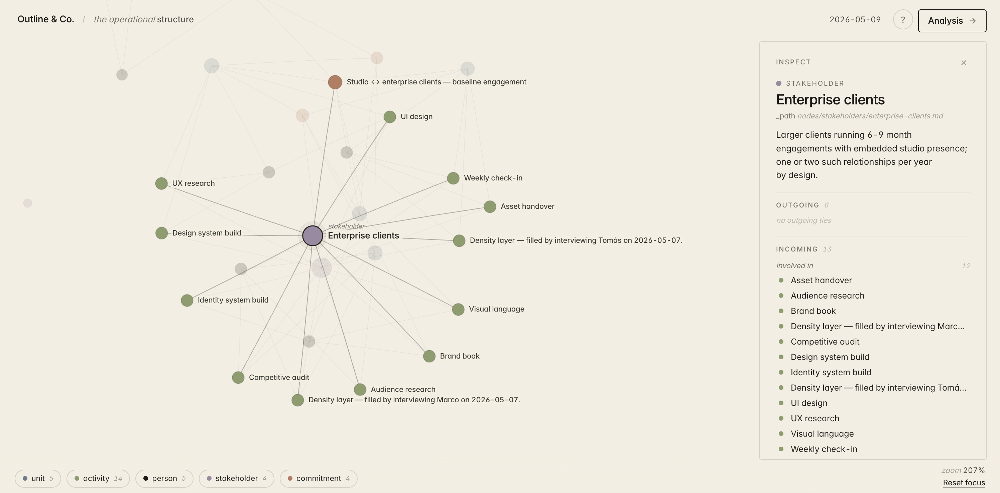
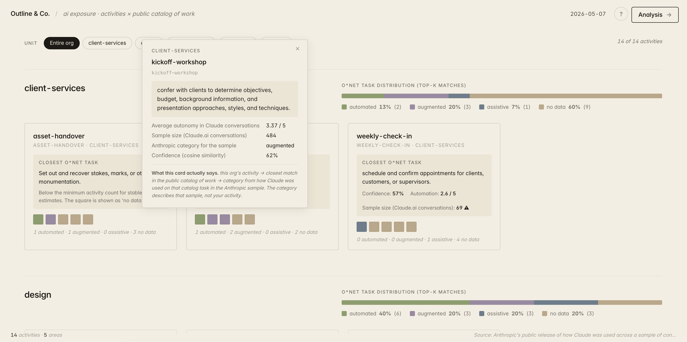
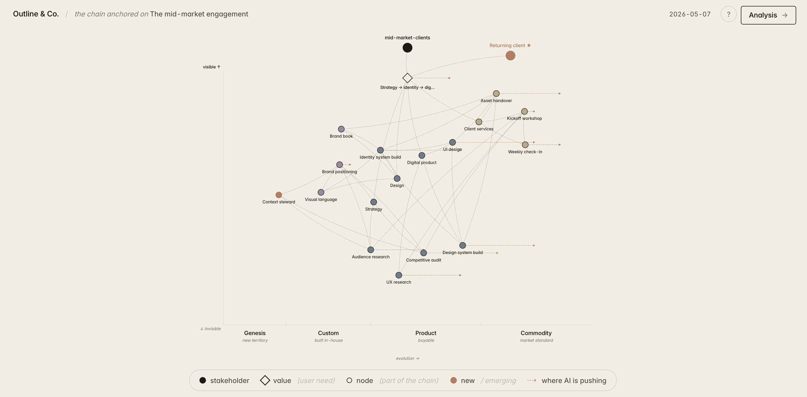
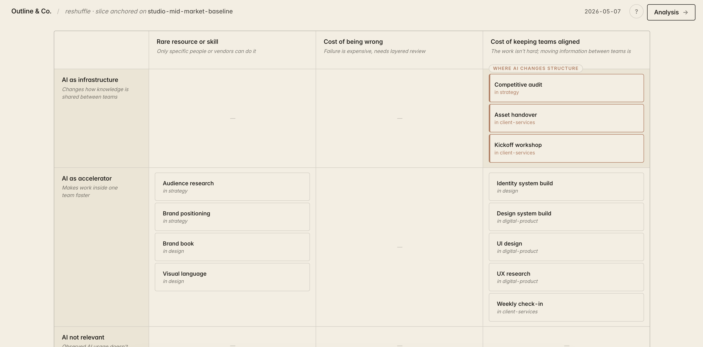
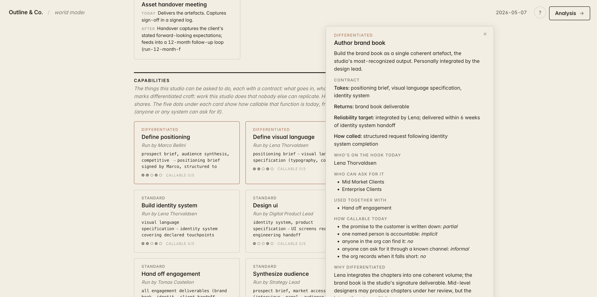

# Playable Org

> An organization, represented as a graph of cited claims, maintained by an agent — and a small library of analytical playbooks that read on top of it.

## Why this exists

The picture of an organization (who works on what, which commitments are load-bearing, where AI is changing the work) gets rebuilt from scattered files each time someone asks. It exists for the minutes the rebuild takes, then dissolves. RAG over the documents helps the agent find passages, but the picture stays ephemeral: nothing the org keeps grows.

**The picture deserves to exist as a thing.** A structured, cited, maintainable graph of who-does-what-for-whom, every claim pointing back to a real document. An agent reads the org's actual files and proposes diffs the human confirms. Once the graph is real, analyses run on it that would be too brittle on raw text: how AI is used on the closest matched task in a public sample, what holds a work bundle together, what the whole organization looks like as one connected picture.

The lineage is Andrej Karpathy's [*Building an LLM Wiki*](https://gist.github.com/karpathy/442a6bf555914893e9891c11519de94f) (gist, May 2026): a markdown corpus maintained by an LLM agent that follows a `CLAUDE.md`/`AGENTS.md` contract, with `index.md` as catalog and `log.md` as audit. We borrow the pattern. We call our artefact `org/`, not a wiki, because the corpus describes a specific kind of thing: an organization. Everything else falls out of that distinction.

## What it is

`org/` is a directory of markdown files. Each file is one node — a unit, an activity, a person, a role, a stakeholder, a commitment, a source, an identity declaration, a glossary term, a financial summary. The frontmatter is typed YAML; the body is prose. Every claim in the body cites a `(source-id)`. The mcp server (in `mcp-server/`) exposes thirteen typed primitives that an agent uses to read, write, and lint the corpus. On top, `skills/` holds recipes the agent follows: three for keeping the corpus honest (`init`, `ingest`, `lint`), a **starter kit of playbooks** (`graph`, `ai-exposure`, `value-map`, `reshuffle`, `world-model`) that produce frozen analyses on top of the graph, a `new-playbook` meta-skill that scaffolds your own, and a few helpers for deploying an agent against a specific scope. Each playbook produces an HTML + JSON pair under `org/plays/data/` that you open in a browser. The artefacts you see in this README are real — they come from a fictional sample organization (Outline & Co., a creative studio) that ships with the public template.

## What `org/` looks like

```
org/
│
├── AGENTS.md              operational contract — the agent reads this before any write
├── README.md              entry point for whoever opens the folder
├── index.md               catalog of every node, one line each, kept in sync on every ingest
├── log.md                 prepend-only audit; most recent write on top
├── open-questions.md      ambiguities the agent surfaces for a human to resolve
│
├── identity/              who the organization is
│   ├── mission.md           what the studio is for
│   ├── limits.md            what it explicitly does not do
│   └── rules.md             the governance principles
│
├── nodes/                 the entities that make up the structure
│   ├── units/               areas, divisions, functions
│   ├── people/              named individuals
│   ├── activities/          the work the org actually does
│   ├── roles/               named roles when they exist independently of a person
│   └── stakeholders/        who the org serves and who it depends on
│
├── commitments/           typed relations between nodes — the promise chains
├── financials/            yearly summaries (revenue, costs, headcount)
├── language/              glossary of org-specific terms when needed
│
├── sources/               immutable raw documents — every claim in the structure cites here
│
└── plays/data/            frozen analytical artefacts produced by playbooks
                             graph-<scope>-<date>.{json,html}
                             ai-exposure-<scope>-<date>.{json,html}
                             value-map-<scope>-<date>.{json,html,svg}
                             reshuffle-<scope>-<date>.{json,html}
                             world-model-<scope>-<date>.{json,html}
```

Every node is one markdown file. Frontmatter is typed YAML; body is prose; every claim cites a source.

````markdown
---
id: audience-research
type: activity
parent: strategy
performer: marco-bellini
sources: [outline-charter-2024]
---

# Audience research

Interview client customers, transcribe, synthesise into an insights document.
Runs at the start of every mid-market engagement (outline-charter-2024).
Output: 8–15 page insights document, signed off by the strategy lead.
````

Two invariants hold across the artefact:

- **Every claim in `org/` cites a source under `sources/`.** No exceptions. The lint script refuses commits that violate this. This is the citation invariant — the defence against agent hallucination. Without it, the agent makes things up; with it, every answer points back to a real document.
- **Plays are frozen at creation.** A play asserts the world at time T. Re-running the same playbook at T+N produces a new play; the old one stays as the historical reading. No mutation in place. "What did we conclude in May" keeps meaning that way.

If you read [Simone Cicero's *Through The Boundary*](https://through-the-boundary.simonecicero.com/) you'll recognise the *structure* / *superstructure* distinction we lifted from his April 2026 essay. The structure is what AI makes more necessary: topology, taxonomy, shared context, promise chains. The superstructure is what AI eliminates: hierarchical management, bureaucracy. `org/` is structure-level on purpose; we don't try to model the superstructure at all.

## The bundled playbooks

Five playbooks ship with the template — a starter kit, not a sequence. Each asks a different question of the same corpus and produces an interactive HTML + the JSON that backed it, frozen under `org/plays/data/<name>-<scope>-<date>.{json,html}`. You pick which ones to run, in any order. When none of them fits the question you have, the `new-playbook` meta-skill scaffolds a new one (a five-question interview that emits the `build.py` / `audit.py` / `viewer.py` / `autoresearch.py` quartet ready to fill in).

### graph — operational dependencies

> *Where does the load sit in this organization? Which nodes carry weight, and which are thin?*

Walks every node under `org/` and emits a force-directed picture of the typed dependencies between them — who is in which unit, which person performs which activity, which role covers what, who is bound by which commitment, which stakeholder is touched by which work. Click a node to focus on it; the side panel fills with its incoming and outgoing dependencies, grouped by relation. Source nodes, identity, glossary, and financial summaries stay in the JSON for other tools but are stripped from this viewer — the picture is operational, not corpus.



### ai-exposure — where AI is showing up in this org

> *For each activity in this org, how was AI used today on the closest matched task in a public sample? Which activities are most exposed?*

Source: [Anthropic's Economic Index](https://www.anthropic.com/economic-index) (March 2026 release, ~18,500 task-level descriptions of how Claude was used across a sample of public conversations). For every activity the org actually does, the playbook embeds the description, finds the five nearest task-descriptions in the AEI sample by sentence similarity, and shows how Claude was used in those samples — automated, augmented, assistive, or outside the observed sample. The colour describes what was observed in the AEI sample, not what the activity *is* in this organization. Read it as: *if Claude tried this activity, here's how it would look like work Claude was already doing.*



### value-map — where each piece sits on the evolution curve

> *For an anchor (a commitment, a unit, a stakeholder), where does each piece of the chain sit on the evolution × visibility plane, and where is AI pushing it?*

Source: Simon Wardley, value-mapping. Anchors on a commitment or unit, walks the structure to find the components reachable from the anchor, asks the agent to position each one on the *genesis → custom → product → commodity* axis with citations, and overlays AI pressure per component when an `ai-exposure` play exists in the same slice. Marks emerging components (`is_new`) in conditional voice — *if X became standard, the chain would gain a new piece here* — never *X will happen by Q3*. The map shows where the work sits today and points at where it would move under specific pressures.



### reshuffle — what holds each activity in place, and what AI changes

> *For a process slice, what holds each activity in the current bundle — rare skill, cost-of-being-wrong, or cost-of-keeping-aligned? Which AI uses change the structure (engine), and which just speed it up (tool)?*

Source: Sangeet Paul Choudary, *Reshuffle* (2024). The big idea is that AI does two very different things and they should not be confused: it can accelerate work inside an existing bundle (a tool) or dissolve a constraint that held the bundle together and force a new bundle (an engine). Only engines reconfigure organizations. The playbook asks the agent to identify the constraint type for each activity in the slice (with citations) and to classify each AI use as tool or engine. The output names the rebundle moves the analysis suggests — they are options, not recommendations.



### world-model — the org as a stack

> *What are the organization's capabilities? Which are differentiated, which are standard? What does the org know about itself and the people it serves? What pieces of the chain don't exist yet that the demand already implies?*

Source: Jack Dorsey + Roelof Botha, *From Hierarchy to Intelligence* (Block, March 2026). Reads the organization as a stack: capabilities at the bottom (atomic invocable functions with a contract), a world model in the middle (what the org knows about itself and its stakeholders), an intelligence layer that composes capabilities into responses to stakeholder signals, interfaces that deliver. The Analysis modal names the three structural moves the org would make to actually run the loop: turn interfaces into signal collection, reorganize around the invokable functions, build the memory that decides.



The bundled playbooks are independent. You pick the one that fits the question you have, in any order. They do compose where it makes sense — `world-model` reads outputs of `value-map` and `reshuffle` if they exist in the same slice, `value-map` overlays AI pressure when an `ai-exposure` play is present — but no playbook depends on another being run first. `graph` is usually the lightest first move after the initial `ingest` (it just renders what's there), and `ai-exposure` works as a broad survey, but a deployment that only needs one of the five is a fully valid use of the template.

## The agent has to keep itself honest

LLM-maintained corpora drift. The agent paraphrases when it should cite, claims when it should hedge, repeats yesterday's prose into today's frontmatter. Three deterministic gates keep it honest:

1. **`lint.py`** — Tier 1 catches broken citations, missing frontmatter fields, dangling cross-references, orphan nodes. Tier 2 catches semantic regressions (a commitment with `state: active` whose parties no longer exist, an activity whose performer is no longer in the structure, etc.). Lint runs on every ingest; the lint report sits at the repo root.

2. **Per-playbook `audit.py`** — every playbook ships its own audit script that verifies the play it just produced. Capabilities have non-empty contracts. Components have evolution_target rationale. Bundles cite their constraint. Decisions name a source. The audit gate refuses a play that doesn't pass.

3. **Per-playbook `autoresearch.py`** — five dimensions per play: recognizability (does the prose name specific units / people / commitments of *this* org?), plain language (no framework jargon paraphrased into running prose), decision-anchoring (≥3 decisions, each substantive, each cited), audit-grounded (every cited node id resolves), and an opt-in LLM judge (Claude Sonnet 4.6 scoring each decision on actionable / distinctive / readable). The judge runs in subscription mode by default — the agent in your session applies the rubric in-context, no API key needed.

The autoresearch loop is not optional polish. It's the difference between a play that reads well and a play that reads as written for *this org*. The full rubric lives in `skills/playbooks/AUTORESEARCH-JUDGE-RUBRIC.md`.

## Where it sits

The honest comparison is with other ways of representing an organization, not with tooling.

| Compared to | Playable Org is | Playable Org is not |
|---|---|---|
| Org chart | a graph of six node kinds (unit, activity, person, role, stakeholder, commitment) with typed dependencies between them | not a hierarchy. Commitments are richer than reporting lines (level × direction × explicit × state × fallback) |
| Capability map | a stack of invokable functions with contracts, a world model underneath, interfaces on top — produced by the `world-model` playbook on top of the structure | not a hand-curated catalog. The capabilities are read off the structure by the playbook each time it runs |
| Value-chain map (Wardley, Porter) | the agent walks the structure from a chosen anchor, positions each component on the evolution × visibility plane, marks AI pressure per component — produced by the `value-map` playbook | not pre-drawn by a consultant. The map is computed each time from the org's actual structure |
| Service blueprint | the layered read of how the org meets its stakeholders comes out of `world-model`: interfaces (where stakeholders arrive), capabilities (what gets invoked), world model (the supporting memory) | not a one-shot deliverable. The blueprint is a property of the structure, runnable on demand |
| BPMN / process diagram | activities carry typed performers, inputs, outputs, frequency, and optional trigger / quality_gates / output_format / fallback / handoff | not executable. The structure documents the work; `skills/` runs the analyses |
| Knowledge graph (RDF, Neo4j) | typed YAML frontmatter on every node, structured cross-references between markdown files | not triples. Markdown is the storage, the agent + lint script are the query engine; humans read the graph as prose |
| Hosted wiki (Confluence, Notion) | markdown under an `AGENTS.md` contract, maintained by an agent that reads, writes, and lints; every claim cites a source under `sources/` | not human-edited in a UI. The agent is the editor, with diffs confirmed by a human |

The thing the artefact aims to be is a **structure**: enough cited topology for an agent to act on, minus the bureaucracy of formal ontologies, plus the editorial discipline that keeps the prose readable. (The term comes from Simone Cicero, *[What is an organization today?](https://through-the-boundary.simonecicero.com/p/ttb-1-what-is-an-organization-today)*, April 2026 — the *structure* is what AI makes more necessary; the *superstructure* is what AI eliminates.)

## Opinionated choices

Each is a non-default decision; each has a rationale.

- **Markdown corpus, not RDF triples.** Humans read the graph as prose; agents read both the prose and the typed frontmatter; git tracks revisions. Cost: less query-able than a triplestore. Mitigation: the YAML frontmatter is structured, and the agent is the query engine — through `org_search` / `org_neighbors` / `org_list`.

- **Agent-maintained, not human-edited.** The org's documents change; the agent re-walks them and proposes diffs; humans confirm. Cost: agent reliability is now load-bearing. Mitigation: the three deterministic gates above plus the citation invariant. No claim ships without a source.

- **Plays are frozen at creation; structure is immutable-by-convention.** An analysis at time T must be reproducible at time T+N. Without freezing, plays drift and "what did we conclude in May" loses meaning. Cost: a play goes stale within months. Mitigation: re-running is one `org_play_run` call; the historical play stays as the past reading.

- **Conditional voice on emerging items.** Anything in `org/` or in a play that names a thing *that doesn't exist today* (a new component, a new stakeholder type, a candidate role, a piece-to-build) is written with `if / would / could / depends on`, never `when / will / makes`. Cost: prose feels less assertive. Gain: the artefact reads as an analysis, the org keeps agency. The map suggests preconditions are approaching; whether to build the thing stays the org's call. Documented in `skills/STYLE.md`.

- **Plain-language jargon discipline in user-facing prose.** Framework primitive names are fine as labels (Stakeholders, Capabilities, Genesis/Custom/Product/Commodity); paraphrased into running prose they become jargon and the leader stops on them. Avoid-list (lives in `STYLE.md`): *moat*, *commodity* in body, *commoditize*, *judgment density*, *capability stack*, *coordination tax*, *failure-signal*, *thin* (metaphor), *see-saw*, *flywheel*, *engine candidate*, *rebundle*, *production-tier*, *rich subset*, *O\*NET*, *AEI*, *embedding*, *cosine similarity*, *top-K*, *p25*/*p75*, JSON field names. The autoresearch jargon dimension catches deterministic violations; the editorial pass catches paraphrased ones.

- **Activity density layer is opt-in per activity.** A first-install activity has the structural floor (description, performer, unit, inputs/outputs, frequency, sources). The density ceiling — `trigger` / `quality_gates` / `decision_criteria` / `output_format` / `fallback` / `handoff` — gets filled only when the org wants to compile that activity into a Claude skill. Cost: two registers in the same schema. Gain: the floor stays low (every activity has structural facts); the ceiling opens for the activities that need to become agent-runnable. Documented in `org/AGENTS.md`.

## Use it with Claude

The template runs as a local MCP server. Two clients are first-class: **Claude Desktop** (the desktop app, most common — chat UI, playbooks open as HTML in the browser) and **Claude Code** (the CLI, terminal-native, git-aware — for maintaining `org/` weekly and authoring playbooks). claude.ai web doesn't yet support local MCP servers, so the web app is not supported today. macOS and Windows are both supported on both clients.

### With Claude Desktop

1. **Get the folder.** Open [github.com/Play-New/playable-org](https://github.com/Play-New/playable-org), click the green **Code** button → **Download ZIP**, and extract it. Or, from the command line: `git clone https://github.com/Play-New/playable-org.git`. The downloaded folder is called `playable-org-main` — rename it to `playable-org` if you want, or leave the suffix.
2. **Have Claude Desktop and Node.js installed.** [Claude Desktop](https://claude.ai/download). [Node.js LTS](https://nodejs.org) (the installer checks and tells you if it's missing).
3. **Run the installer.** Double-click `install.command` (macOS) or `install.bat` (Windows). It builds the mcp server and registers it in Claude Desktop's config — no admin required. Restart Claude Desktop.
4. **Populate the structure.** Either drop founding documents (charter, role descriptions, contracts) into `org/sources/` (Path A — documents-first), or open Claude Desktop and ask it to *initialize the structure* with no documents (Path B — interview-first; the ten-question interview transcript becomes the founding source).
5. **You're in.** Ask questions in plain language, ingest new documents as they arrive, run playbooks (*"run the value-map on the customer-facing unit"* / *"run ai-exposure across the whole org"* / *"show me the whole org as one graph"*), open the rendered HTML in your browser.

### With Claude Code

```bash
git clone https://github.com/Play-New/playable-org.git
cd playable-org
cd mcp-server && npm install && npm run build && cd ..
claude   # approve the project-scoped server on first launch
```

The repo ships a `.mcp.json` at the root; Claude Code auto-detects it and asks for approval the first time. From there the `init` / `ingest` / playbook flow is identical to Claude Desktop — only the surface changes (terminal session with file writes and git diffs visible, instead of a chat window). Both clients read and write the same `org/` on disk.

Detailed walkthrough with prerequisites and troubleshooting for both flows: [`SETUP.md`](SETUP.md). Architecture: [`docs/architecture.md`](docs/architecture.md). Playbook reference: [`docs/playbooks.md`](docs/playbooks.md). Extension: [`docs/extending.md`](docs/extending.md).

## What ships in the public template

- **mcp-server/** — TypeScript stdio mcp server. Thirteen tools, full e2e suite at `mcp-server/test-e2e.py` (238/238 pass, covering pipeline tests + design-regression checks for each viewer), ~30KB compiled.
- **skills/** — eleven recipes. Three operational (`init`, `ingest`, `lint`); five playbooks (`graph`, `ai-exposure`, `value-map`, `reshuffle`, `world-model`); two deployment skills (`compile-agent` for scope-limited agents, `interview-activity` for filling the activity density layer); one meta-skill (`new-playbook`).
- **mcp-server/test-fixtures/sample-org/** — a fully populated test fixture: Outline & Co., a fictional creative studio (5 units, 14 activities, 5 people, 4 stakeholders, 4 commitments, 3 sources). Ships with the five canonical playbook artefacts (HTML + JSON + judge verdicts). Open `plays/data/*.html` in a browser to see exactly what each playbook produces.
- **install.command** / **install.bat** — clickable installers (no admin required). Build the mcp server, register it in Claude Desktop's config.
- **docs/** — public-facing architecture, playbook reference, extension guide, design direction.
- **The empty public org/** — three identity stubs marked `# REPLACE ME`. Forks populate it from real org documents.

## Honest limits

- Forks of this template need a real organization with documents to populate. The empty public template is a kit, not a tool. Path B (interview-first) helps when documents are scarce, but the agent is only as honest as the human in the loop.
- The mcp server uses stdio and has been exercised against Claude Desktop. Nothing in it depends on Claude specifically — any MCP-compatible client should work — but we test the Claude pairing.
- The autoresearch LLM judge calls Claude Sonnet 4.6 in API mode (when explicitly opted in) and Claude in your session in subscription mode. The deterministic four dimensions don't depend on any LLM and run offline.
- Plays go stale within months. Re-running a playbook is cheap; deciding *when* to re-run is operational discipline that the public template doesn't ship — it lives per-deployment.
- The activity density layer is structurally heavy when filled across a whole org. A first-install density-filling pass is on the order of a few hours per ten activities. The skill scales by per-activity opt-in, not whole-org sweep.

## Lineage

The pattern — an LLM-maintained markdown corpus governed by a `CLAUDE.md` / `AGENTS.md` contract, with `index.md` as catalog and `log.md` as audit — is from Andrej Karpathy, [*Building an LLM Wiki*](https://gist.github.com/karpathy/442a6bf555914893e9891c11519de94f) (gist, May 2026). We keep the pattern and call our artefact `org/`, not a wiki.

The term **structure** for the cited-graph layer comes from Simone Cicero, *[What is an organization today?](https://through-the-boundary.simonecicero.com/p/ttb-1-what-is-an-organization-today)* (Through The Boundary, April 2026), which contrasts the *structure* of an organization (topology, taxonomy, shared context, promise chains) — what AI makes more necessary — with the *superstructure* (hierarchical management, bureaucracy) — what AI eliminates.

The five playbooks compose established analytical frameworks:

- **ai-exposure** — Anthropic Economic Index v1, March 2026 release.
- **value-map** — Simon Wardley, value-mapping.
- **reshuffle** — Sangeet Paul Choudary, *Reshuffle* (2024).
- **world-model** — Jack Dorsey + Roelof Botha, *From Hierarchy to Intelligence* (Block, March 2026).
- **graph** — no external source; the structure rendered as the structure declares itself.

Author surnames appear in this README and in `skills/` documentation for credibility and reproducibility. They never appear inside `org/` artefacts (structure or plays) — those are written for the leader of the org being mapped, not for someone tracing the playbook's intellectual ancestry.

## Contributing

PRs welcome. The contribution guide is in [`CONTRIBUTING.md`](CONTRIBUTING.md). The unobvious bits:

- Adding a new playbook means: `skills/playbooks/<name>/{SKILL.md, build.py, audit.py, viewer.py, autoresearch.py}` plus a row in `skills/ROADMAP.md`, a section in `docs/playbooks.md`, and a build-mode test in `mcp-server/test-e2e.py`. The viewer must use `design.py` primitives — no bespoke `<style>` blocks beyond a slim playbook-specific extension that uses design tokens.
- Adding a new mcp tool means: `mcp-server/src/tools/<name>.ts`, register in `mcp-server/src/server.ts`, e2e test, doc update in `docs/architecture.md` if the surface area changes.
- Adding to the schema (a new node kind, a new YAML field, a new edge type in the graph) is a heavier change because it cascades through `org/AGENTS.md`, `lint.py`, the relevant `build.py` files, and the graph's edge label set. Open an issue first so we can think it through together.

The intentional abstraction: this project codifies *the pattern* — cited structure, agent maintainer, frozen plays, deterministic gates. Each fork instantiates the pattern with its own organization, its own working language, its own brand font, its own playbooks. We don't ship the operational layer (DRIs, cadence, named accountability for each playbook on a deployment) — that's per-fork, per-org, per-deployment, and trying to ship it would defeat the point. See [`docs/skills-as-capabilities.md`](docs/skills-as-capabilities.md) for the longer thought.

## License

MIT. See [`LICENSE`](LICENSE).

The bundled Inter Variable font is licensed under the SIL Open Font License (Rasmus Andersson). Forks that ship a different brand font replace `_assets/fonts/inter-variable.woff2` with their own woff2 at the same path. The Anthropic Economic Index dataset shipped with `ai-exposure` is licensed under CC BY 4.0 (Anthropic).
