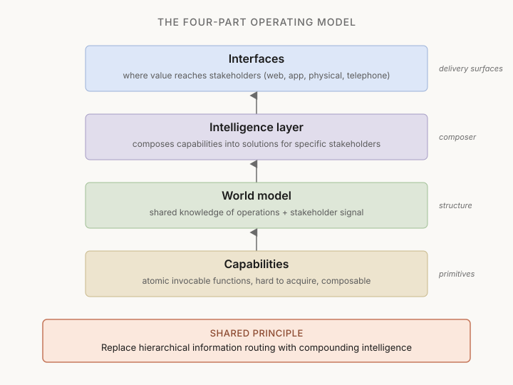

# Capabilities, what they are and how to expose them

Methodology document, applicable to any organization. Defines what a capability is in the operational sense, how it differs from things that are not capabilities, and what exposing it means so that it becomes a composable building block instead of an internal practice.

References: Jack Dorsey + Roelof Botha, "From Hierarchy to Intelligence" (Block, March 2026); Sangeet Choudary, "Reshuffle" (2025). Concepts are distilled from the sources, not reproduced.

This document governs the methodology behind any skill that touches capability analysis (currently `world-model`, partially `reshuffle`). For the writing rules that govern consumer-facing output, see [STYLE.md](STYLE.md).

---

## The frame, in one diagram

The four layers stack from the bottom up. Capabilities at the base are atomic invocable primitives. The world model is the shared knowledge of operations and stakeholder signal that capabilities feed into and read from. The intelligence layer reads the world model and composes capabilities into solutions for specific stakeholders. Interfaces deliver those solutions where stakeholders are.

The shared principle below is what justifies the whole stack: replace hierarchical information routing (the middle-management layer) with a system that compounds intelligence over time. Each call to a capability adds to the world model, which improves future compositions, which makes capabilities more valuable, which compounds.

The rest of this document defines each layer rigorously, gives a practical test for what counts as a capability, lists the rules of exposing them, and describes the organizational consequences. Skip to the section relevant to your question.

---

## Definition

A capability is an **invocable function** of the organization. Anyone, inside or outside, can call it and obtain an execution.

Five properties define it. All five must hold.

1. **Invocable.** A declared, repeatable way to activate it exists. Anyone who knows it exists can call it.
2. **Produces structured output.** Not an opinion or a conversation: a verifiable result.
3. **Atomic.** Does not decompose further into simpler functions that live elsewhere. Sits at the right granularity to be a building block.
4. **Hard to acquire.** Requires regulation, network effects, accumulated expertise, institutional trust, or some combination. Cannot be reproduced overnight.
5. **Composable.** Usable on its own or chained with other capabilities to build different flows. Has no UI of its own: a building block, not a product.

If one or more of these is missing, it is not a capability. It is an asset, a property, a governance organ, a compliance machinery, or a staff function. Useful things, of a different kind.

---

## The practical test

For each capability candidate, four questions:

1. **Who can call it, from inside or outside?** If the answer is "the team that hosts it, through their internal procedures", it is not exposed as a capability.
2. **What does it return, in concrete terms?** If the answer is vague (support, oversight, management), the contract does not exist, it is not an exposed capability.
3. **What are the operational targets (time, quality, coverage)?** If none are declared, it functions as practice, not as capability.
4. **Can it be composed with another capability to produce a different flow?** If the same fixed sequence is required every time, it is not composable, it is a process.

Four concrete answers out of four equals an exposed capability. One vague answer equals a latent capability, not exposed. More than one vague answer means it is not a capability in the operational sense.

---

## What is not a capability

Working with large organizations, candidates that look like capabilities and are not surface often. Distinguishing them matters, because calling something a capability when it is not disorients the entire strategic conversation.

**Assets and properties.** Brand, accumulated trust, capillary territorial presence, years of history, recognized user base. These are things that capabilities *use* when activated. They are not invocable operations. A territorial network is not a capability, the capability is "mobilize-territorial-campaign" (which uses the network as an asset).

**Governance organs.** Boards, committees, statutory bodies. These are approval steps *inside* capabilities (for example: an approval committee is part of "decide-funding"). They are not capabilities on their own.

**Compliance machinery.** Risk management systems, codes of ethics, regulatory frameworks, audits. Necessary to operate, but they are constraints on all capabilities, not capabilities in themselves.

**Staff functions.** HR, IT, accounting, procurement. Capabilities sit inside them ("execute-payment", "onboard-new-colleague") and are usually commodity-grade, present in any organization. Necessary, not differentiating.

**Codified cross-team processes.** A dossier passed across three areas with structured documentation looks like a capability but is a process. The underlying capability ("evaluate-cross-team-request") exists but is not exposed, it is incarnated in the practice.

**Strategic aspirations.** "Innovation", "customer centricity", "organizational agility". Slogans, not capabilities. Without an invocable contract they are nothing.

---

## The three-actors rule

Each capability must be callable by at least three different types of actor. If only one type uses it, it is probably too specific to that channel and should be decomposed or reformulated.

The three typical types:
- **External stakeholder** (user, customer, donor, supplier, regulator, partner)
- **Another capability of the organization** (composition)
- **Intelligence layer** (a system that recognizes a signal and composes a response)

If the capability is callable by all three, it is correctly exposed. If only one of the three calls it, it is a practice in disguise.

---

## The "users and contributors" rule

In the old framing, an organization has customers who receive and employees who produce. In the exposed organization, every actor is both: uses capabilities of the organization and contributes through others.

Example: in a payments system, the merchant who receives revenue is a user of payment-processing capabilities and a contributor through transactional data (which feeds the world model). The consumer who pays is a user of transfer capabilities and a contributor through spending signal.

The same pattern repeats across stakeholders in any organization when this approach is applied. A donor of a foundation invokes "designate-recipient" capabilities and contributes through donation history (signal that feeds the customer-side world model). A researcher invokes "request-grant" capabilities and contributes through scientific output (signal for new funding cycles). A volunteer invokes "join-campaign" capabilities and contributes through territorial work.

The consequence for capability design: the contract must be bidirectional by design. The capability does not only receive input from the actor and return output. It also returns signal to the world model of the organization, which feeds future compositions.

---

## What "exposing" a capability means

Exposing means five things. All five together.

### 1. Public contract

For each capability, an explicit declaration:

- **Input**, what it accepts as a request
- **Output**, what it returns
- **Operational targets (SLO)**, reliability, time, coverage, measured quality. Concrete numbers, not adjectives.
- **Regulatory constraints**, limits that cannot be relaxed. Which laws, codes, required approvals.
- **Invocation modality**, how to activate it (interface, channel, protocol).

Without a public contract the capability remains practice: anyone who wants to use it has to know who is on the team and talk to them case by case. Unfit for composition.

A useful consequence: writing the contract forces honesty about maturity. If the operational targets cannot be declared, it is because they have never been measured, and the capability is less mature than assumed.

### 2. Team ownership, not hierarchical ownership

A capability needs a dedicated team that owns it across time:

- **Individual contributors (ICs)**: deep specialists in the domain. They build and operate the capability.
- **Player-coach**: combines building with developing people. Not a middle manager, does not spend the day on reporting and alignment. Still writes code or designs flows, and develops the ICs in addition.

Important: the capability is not owned by the area or division that hosts it today. A capability that crosses multiple areas is detached from all of them and given to a team that owns it end to end. Areas continue to exist as containers of the capabilities they host, but they are no longer the unit of ownership.

Consequence: the organizational transition is not trivial. Capabilities already contained in a single area can be exposed quickly. Capabilities that cross two or three areas require deeper redesign.

### 3. Discoverability

Anyone who wants to compose two capabilities must be able to find them. Three concrete forms:

- **Internal registry** of capabilities with their contracts, accessible to all.
- **Composition examples** documented: who used it, in which context, with what outcome.
- **Visibility on current invocations** when relevant: who is using what, now.

Without discoverability, capabilities are reinvented every time they are needed. A team needs to publish an informational report and rebuilds the editorial flow from scratch, ignoring that a "publish-content" capability already owned by the editorial team exists.

### 4. Programmatically invocable

For software-mediable capabilities (example: process-payment, disburse-funds, publish-content), the call is an API. Standard, versioned, documented.

For inherently human-mediated capabilities (example: cultivate-major-relationship, execute-testamentary-succession, structure-institutional-partnership), the call is a **structured request channel**: an endpoint that receives the request, a human workflow that takes it on, a structured return. Not a spontaneous meeting, a discoverable protocol.

The crucial point: human capabilities are also exposed as functions. The difference between an exposed capability and a practice is that the first can be invoked by the intelligence layer when the world model detects a signal, while the second requires a human to notice and activate the human cycle.

### 5. Logged failures

When a capability is called and cannot fulfill the request, because a sub-piece is missing, because a regulatory constraint prevents it, because the world model does not have enough data to respond, the failure is logged.

The failure log contains: what was requested, what the capability could not do, what would be needed for it to do so.

That log is the **future roadmap of the organization**. Not the three-year plan that top management decides at a table. Missed compositions are missed opportunities; logging them is the organization's version of market feedback.

Example: the "execute-testamentary-succession" capability receives a request to handle a complex asset (real estate with condominium difficulties, anomalous lease). The capability today does not have the sub-capability "transform-complex-real-estate-asset" and falls back on quick sale below value. The log says: "real-estate transformation request, missing capability". That log line is the first specification of the future capability `transform-complex-real-estate-asset`.

Without a failure log, the roadmap comes from whoever has more authority in the planning process, not from whoever is closest to the signal.

---

## The three roles that emerge

Once capabilities are exposed, the organization no longer needs a permanent middle-management layer. The structure reduces to three roles:

- **Individual Contributor (IC)** builds and operates a capability layer (or the world model, or the intelligence layer, or the interfaces). Deep specialist. The world model provides the context that a manager used to provide, so the IC can decide without waiting for instructions.

- **Directly Responsible Individual (DRI)** owns a problem or an opportunity that crosses capabilities for a defined period (typically 90 days). Has authority to pull resources from the teams of the relevant capabilities. When the outcome is reached or the period ends, the DRI moves to another problem.

- **Player-coach** still builds (code, flows, content) and develops the people of the team. Replaces the traditional manager whose primary job was information routing.

What the middle manager did, coordinating, aligning, reporting, the system handles via the world model. Strategy and priorities are decided by the DRI structure for outcomes.

Important: this transition is slow. For organizations with heavy compliance, stakeholder networks built over decades, consolidated area-lead structures, it is a transition of years, not months. The value of this approach in the short term is as a thinking tool, not as immediate restructuring.

---

## Two common errors to avoid

### Error 1: AI as accelerator without exposing capabilities

The most frequent mistake is deploying AI to accelerate single work inside a unit, without first exposing the capabilities that cross multiple units.

Result: the AI-equipped unit runs faster, the others remain unchanged. The asymmetric speed worsens the coordination problem, because the fast unit produces output the others cannot digest. The total cost of keeping the organization aligned **increases** instead of decreasing. Choudary calls this the "coordination paradox".

The fix is to expose capabilities before accelerating them. An exposed capability can be called symmetrically by all units, the speed is distributed, not concentrated.

### Error 2: Confusing capabilities with governance organs

Treating a committee (ethics, scientific, oversight) as a capability is wrong.

A committee is an approval step that lives *inside* a capability. The "decide-funding" capability can contain "approve-by-scientific-committee" as an internal step. The committee is not callable as an autonomous capability by third parties.

The distinction matters because the committee as an organ has a different nature: non-composable by design, fixed calendar, decisions are governance acts not responses to requests. Treating it as a capability makes compositions fail because the committee calendar constrains the calendar of all capabilities that include it.

The fix: in the capability registry, declare explicitly which capabilities include governance-organ steps, and declare the organ calendar as a constraint of the capability SLO. Not as a separate capability.

---

## The transition, sequenced

For an organization starting from zero or near zero, the practical sequence:

1. **Identify capabilities.** Apply the test (five properties, four questions). Distinguish from assets, properties, governance organs, infrastructure, staff functions. Expect to find between 5 and 15 in a medium organization. If you find 50, you are calling capabilities things that are not capabilities.

2. **Write the contracts.** For each: input, output, SLO, constraints, invocation modality. This forces honesty about maturity. The capabilities that struggle to write the contract are the ones least mature.

3. **Assign ownership.** One team per capability, even if this means detaching it from the area that hosts it today. Capabilities crossing multiple areas require the deepest change.

4. **Make them discoverable.** Internal registry with composition examples and current invocations.

5. **Make them invocable.** API for software-mediable ones, structured request channel for human-mediated ones.

6. **Log composition failures.** Start measuring what the organization cannot compose. That log becomes the roadmap.

7. **Build the intelligence layer** (long term). A system that, given a world-model signal, composes capabilities automatically. This is the AI-heavy piece. Steps before this cannot be skipped.

The first six are organizational. Possible in 12 to 24 months for a medium-sized organization without large technological investments. The seventh is of a different order of complexity.

---

## When the frame applies and when it does not

**Applies well** when:
- The organization has multiple functional areas with stakeholders that cross boundaries.
- A variety of stakeholders potentially can invoke the same capabilities in different ways.
- The aspiration is to use AI strategically, not as a marginal productivity tool.
- There is willingness to question the existing organizational structure.

**Does not apply well** when:
- The organization does one thing with one stakeholder type. The frame is overkill.
- Stakeholder signals are too thin to feed meaningful compositions.
- Regulatory boundaries make capability decoupling from areas impossible.
- The organization is not ready for the structural conversation and would treat the approach as a theoretical exercise.

---

## The honest test before starting

Before applying the frame to an organization, a calibration question:

> What can any stakeholder invoke today, by name, and receive a structured response from?

If the answer is "depends on who you ask, depends on which area you reach", capabilities exist as practices, not as exposed functions. The frame applies and has value.

If the answer is "this, this and this, each with a known contract, accessible to anyone who knows how to call it", the organization has already done the exposing work. The frame applies as a tool of maintenance and discovery of missing capabilities, not as structural reform.
